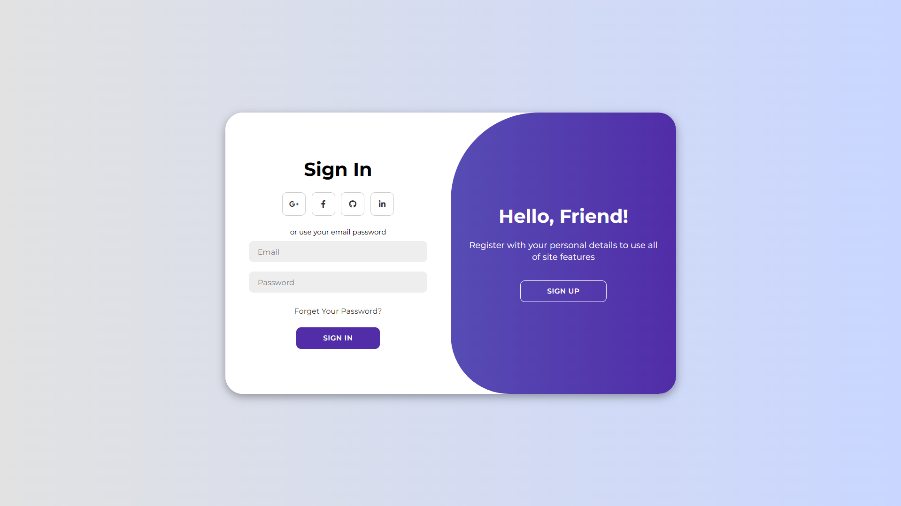
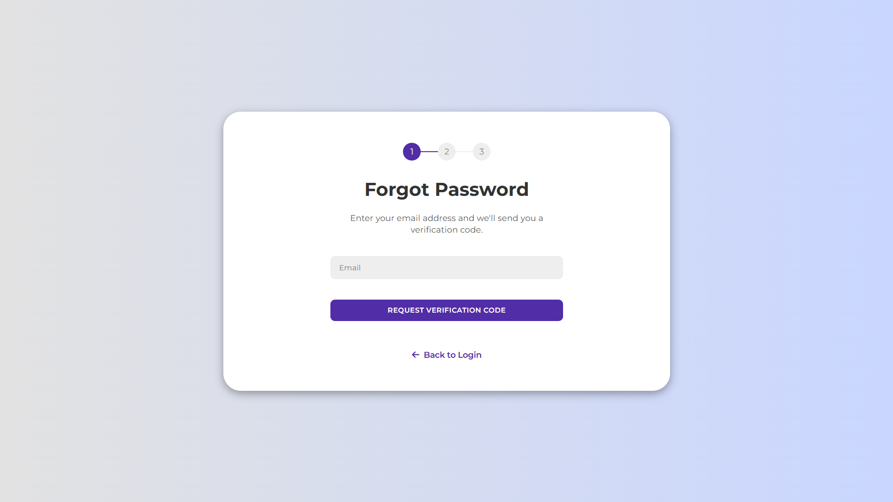

# Responsive Sign-in, Sign-up, and Forgot Password System

## Description
This project provides a responsive web interface for user authentication, including sign-in, sign-up, and forgot password functionalities. It is designed to be user-friendly and adapt to various screen sizes.

## Features
* Responsive design for optimal viewing on different devices.
* User sign-in form.
* User sign-up form.
* Forgot password functionality.
* Separate CSS and JavaScript files for each module.

## Technologies Used
* HTML5
* CSS3
* JavaScript

## Screenshots



## Getting Started
To get a copy of the project up and running on your local machine for development and testing purposes, follow these steps:

### Clone the repository:
```bash
git clone https://github.com/ananta-devs/responsive-signin-signup-forgot-password-form.git
```

### Open in your browser:
Open `login.html` or `forgot_pass.html` in your preferred web browser.

## Contributing
Contributions are welcome! If you'd like to contribute, please open an issue or submit a pull request.

